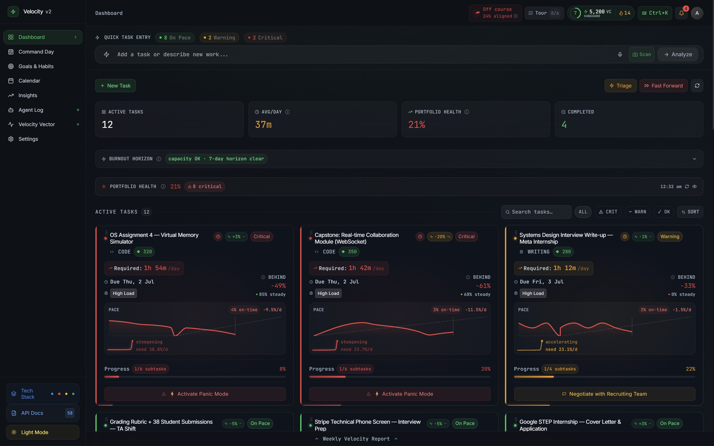
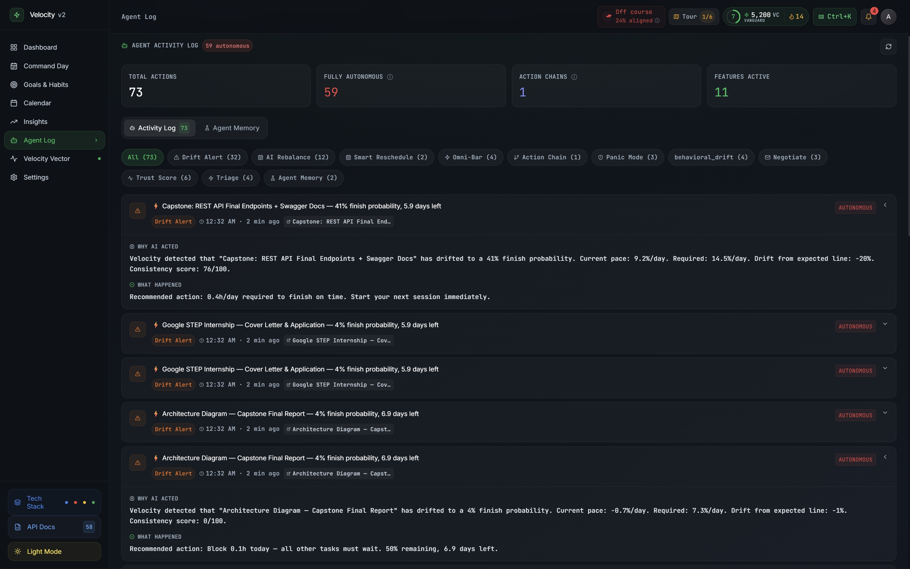
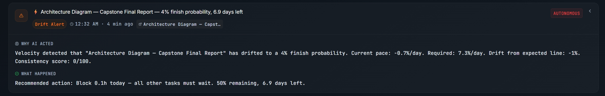
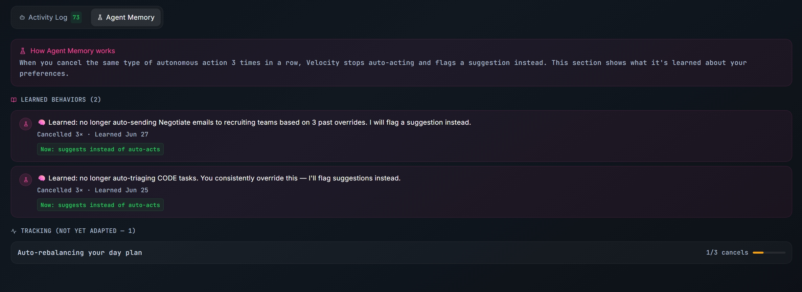
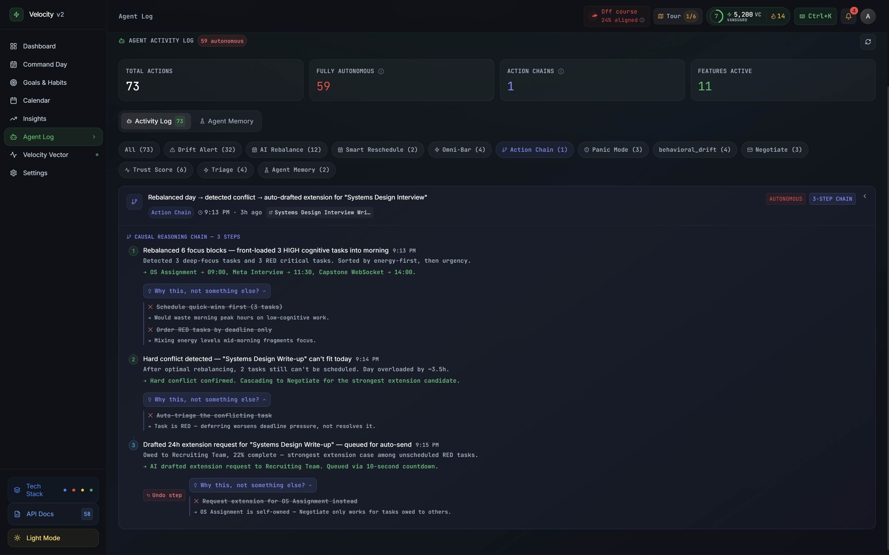
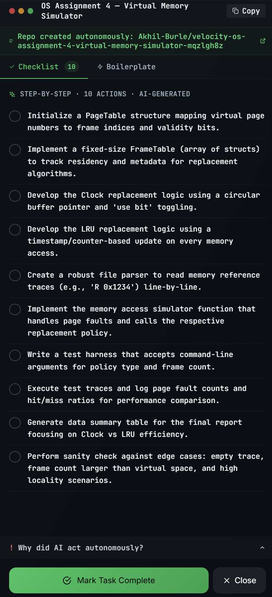
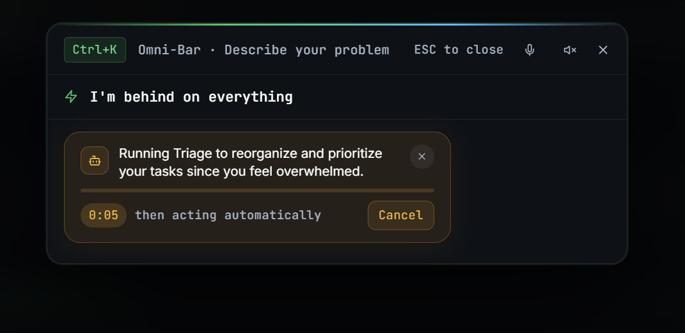
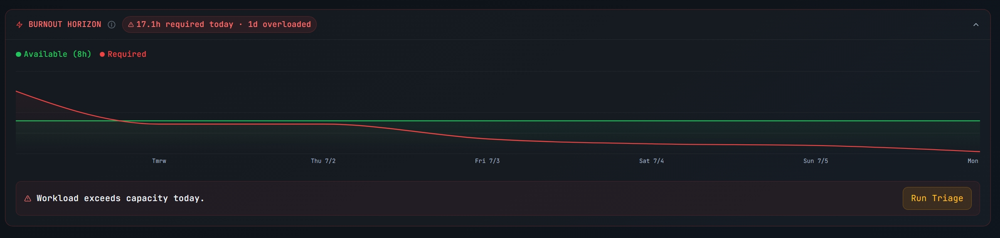

<div align="center">


# ⚡ Velocity — AI Productivity Agent

### *An AI that acts before you miss the deadline — not after.*

<br/>

[](https://velocity-500511.web.app)
[](https://velocity-500511.web.app)
[](https://velocity-500511.web.app)
[](https://velocity-500511.web.app)

<br/>

<!-- HERO SCREENSHOT: Full dashboard showing GREEN/AMBER/RED task cards, sparklines, and stats grid -->


<br/><br/>

> **Zero setup for judges.**
> Click **"Enter Demo Sandbox"** — it types credentials on-screen and drops you straight into a pre-seeded dashboard. No signup, no wait.
>
> 🔑 Persistent login: `demo` / `velocity2026`

<br/>

---

</div>

## 🚨 The Problem

Productivity tools fail at the *exact* critical moment they're needed most.

- They are **passive ledgers** — they record what you planned, not what's actually happening
- By the time a miss is obvious, it's **too late** for anything but damage control
- They wait for you to tell them you're behind — you're often the last to know

**Velocity removes the human from the loop** for low-stakes interventions, and gives full control back — with a complete audit trail — for the consequential ones.

---

## 🤖 Why This Is Agentic, Not Just AI-Assisted

> Most "agentic" submissions mean: user types → AI suggests → user clicks apply. That's a smart assistant. **An agent does things.**

Velocity earns the label through three specific, verifiable mechanisms:

<table>
<tr>
<td width="33%" align="center">

### 🔁 Actions Without Prompts
`autonomy: "autonomous"`

- Forecast Agent runs on a **polling loop**
- When finish probability drops below **45%**, it writes a recovery action to the Activity Log
- **No button clicked. No user trigger.**
- The `autonomy` field on that log entry is literally `"autonomous"`

</td>
<td width="33%" align="center">

### 🧠 Memory That Changes Behavior
`policy_adapted`

- Cancel the same action **3 times** and the system writes a `policy_adapted` log entry
- *"Learned: no longer auto-sending Negotiate emails to professors"*
- Future OmniBar parses for that category get **downgraded from `high` to `medium` confidence**
- The agent acts **differently** based on your history

</td>
<td width="33%" align="center">

### ⛓️ Multi-Step Chains
`isChain: true`

- AI Rebalance → detects conflict → drafts extension email — **without pausing to ask**
- Logged as a single `isChain: true` entry
- Per-step undo + `rejectedAlternatives` reasoning at each step
- *"Why not auto-triage? Task is RED — deferring worsens pressure"*

</td>
</tr>
</table>

> **The receipts:** Every autonomous action is in the Agent Activity Log with `reasoning`, `outcome`, `autonomy` level, `rejectedAlternatives`, and undo support. Verify the claims by opening the log.

<!-- ACTIVITY LOG SCREENSHOT: Agent Activity Log showing entries with autonomy badges ("autonomous", "countdown", "assisted"), expanded chain entry with per-step reasoning and undo controls -->
<div align="center">

</div>

---

## ✨ Feature Walkthrough

### 🔮 1. Forecast Agent + Behavioral Drift Detection
`autonomy: "autonomous"` — fires without any user trigger

- Runs a **4-factor finish probability model** on every active task:
  - Drift × Velocity Adequacy × Consistency × Deadline Pressure Amplifier
- Below **45% probability** with no recent alert → agent writes a `drift_alert` to the Activity Log with a specific recovery instruction — **unprompted**
- Behavioral Drift cross-checks self-reported progress against **4 passive signals**:
  - Subtask completion ratio *(55% weight)*
  - Pace-line staleness *(30% weight)*
  - Panic Mode usage *(15% weight)*
  - OmniBar language sentiment via Gemini
- Gap > 25% → logs a `behavioral_drift` entry **autonomously**

> 📌 *This is "beyond passive reminders" — the system detects, calculates, and records without being invoked.*

<!-- DRIFT ALERT SCREENSHOT: Activity Log showing a drift_alert entry with autonomy="autonomous" badge and recovery text "Velocity is 2.1%/day but needs 5.3%/day" -->
<div align="center">

</div>

---

### 🧠 2. Policy Memory — Adaptive Learning From Cancels
`autonomy: "autonomous"` — behavioral change fires on the 3rd cancel

- Increments a counter per `(user, action-category)` pair:
  - `negotiate_professor`, `triage_code`, `rebalance_general`
- On the **3rd cancel**: flips `status` to `'learned'`, writes a `policy_adapted` log entry, and permanently downgrades that category from auto-acting to suggesting
- **Demo account ships pre-seeded at 2-of-3** cancellations on `negotiate_professor`
- The judge's **first cancel of a Negotiate action** is what flips the policy live — watch the `policy_adapted` entry appear in real time

> 📌 *Makes the agent calibrated to **this** user over time, not just smart on first use.*

<!-- POLICY MEMORY SCREENSHOT: Activity Log showing a policy_adapted entry appearing live with "🧠 Learned: no longer auto-sending..." message and cancelCount: 3 -->
<div align="center">

</div>

---

### ⛓️ 3. Cascade Chain — Multi-Step Autonomous Sequence
`autonomy: "autonomous"` — three steps from one click

- **AI Rebalance → detects hard conflict → auto-drafts Negotiate extension email**, without pausing
- Logged as a single `isChain: true` entry with:
  - Per-step undo controls
  - `rejectedAlternatives` reasoning at each step
  - Full audit trail
- Policy Memory is checked before executing — 3 prior cancellations degrade it to a suggestion

> 📌 *Multi-step sequencing with documented reasoning traces — one click, three consequential decisions.*

<!-- CASCADE CHAIN SCREENSHOT: Activity Log chain entry expanded showing 3 steps with individual reasoning fields and undo buttons, isChain badge visible -->
<div align="center">

</div>

---

### 🚨 4. Panic Mode — Zero-Hour Rescue
`autonomy: "assisted"` → `"autonomous"` when GitHub token is configured

- One click on any **RED task** triggers Gemini to generate:
  - An **8–15 step rescue checklist** with specific actions
  - **Runnable boilerplate code** or document outline
- Optionally **creates a public GitHub repo** via the GitHub API, commits the scaffold, and returns the live URL
- All three happen **in one action** — result is cached on the task object
- Full scaffold delivered in **under 30 seconds**

> 📌 *The most literal answer to "complete tasks before deadlines are missed" — verifiable GitHub commit in one click.*

<!-- PANIC MODE SCREENSHOT: Panic Mode panel showing completed checklist and "View GitHub Repo →" link with a real URL -->
<div align="center">

</div>

---

### ⌘K 5. OmniBar — Agentic Command Center

- A **floating command palette** triggered by **Ctrl+K** anywhere in the app
- Describe your problem in **plain English** → Gemini surfaces the exact tool
- **Voice input** via Web Speech API with waveform animation
- **8 intent types:** `panic | triage | negotiate | add_task | check_eta | ultimatum | mark_complete | info`
- **600ms debounce** after typing; Enter skips debounce
- **Voice output** via Google Cloud TTS — AI responses synthesized as MP3, streamed as audio

<!-- OMNIBAR SCREENSHOT: OmniBar overlay open with AI response card, matched task chip, and action buttons visible -->
<div align="center">

</div>

---

### 🧠 6. Brain Dump Engine + Chaos Scanner

**Brain Dump** — paste anything, get structured tasks:
- Identifies task type: `CODE / WRITING / DIAGRAM / OTHER`
- Assigns cognitive weight: `LOW / MEDIUM / HIGH`
- Infers deadlines from natural language *("due Friday", "end of month")*
- Generates subtask breakdowns with time estimates
- Writes a drift explanation for each task

**Chaos Scanner** — drop a photo, get tasks:
- Drag-and-drop a **whiteboard, syllabus, or screenshot** → Gemini Vision reads every task
- 4 visual states: idle → dragging → **laser scan animation** → done
- Processing state: swept by a green laser line (Framer Motion) with scanline texture overlay

---

### 📊 7. Burnout Horizon Chart

- **14-day workload projection** showing when you'll exceed daily capacity
- Recharts AreaChart with green "Available" and red "Required" gradients
- `ReferenceArea` highlights burnout zones with `⚠ Burnout Zone` label
- When required > available today:
  - Card gets a **red pulsing glow** animation
  - Banner appears: "⚡ Your workload exceeds capacity today." + **[Run Triage Now]** button

<!-- BURNOUT CHART SCREENSHOT: Burnout Horizon Chart showing green/red area curves crossing, burnout zone shaded, and the red pulsing banner below -->
<div align="center">

</div>

---

## 🏆 Google Technologies Used

| Technology | Role in Velocity |
|---|---|
| **Gemini 2.0 Flash — Vertex AI** | Brain Dump extraction, Chaos Scanner vision, OmniBar intent classification, Panic Mode scaffold, Negotiate drafting, AI Rebalance, Morning Briefing, Ultimatum cost sentences, Behavioral Drift language signal |
| **Gemini Vision (multimodal)** | Chaos Scanner: structured tasks extracted from whiteboard or syllabus photos |
| **Google Calendar API (OAuth2)** | Real calendar events block time in Command Day; Rebalance routes around them |
| **Google Cloud TTS** | OmniBar voice output — AI responses synthesized as MP3 (`en-US-Journey-F`), streamed as base64 audio |
| **Google OAuth 2.0** | Full sign-in flow with `calendar.readonly` scope |
| **Firebase Hosting** | Frontend deployment with SPA rewrite rules |
| **Google Cloud Run** | Backend containerized deployment (Node 20, Dockerfile included) |
| **GCP Secret Manager** | Production secrets (JWT, MongoDB URI, API keys, OAuth tokens) |

> 🔍 **Verify live:** Settings → **Tech Stack** page → real-time API health badges from `/api/health`, reporting `aiBackend: "vertex_ai"` and `mongoConnected: true`

---

## 🏗️ Architecture

| Layer | Stack |
|---|---|
| **Frontend** | React 18 + TypeScript · Vite · Tailwind CSS · Framer Motion · Recharts |
| **Backend** | Node.js + Express · MongoDB Atlas + Mongoose · JWT auth |
| **AI** | Gemini 2.0 Flash via Vertex AI (prod) / Gemini Developer API (dev) — unified `@google/genai` SDK |
| **Hosting** | Firebase Hosting (frontend) + Google Cloud Run (backend) |
| **External APIs** | Google Calendar API · Google Cloud TTS · GitHub API (Panic Mode repo creation) |

- All Gemini calls have **deterministic fallback templates** — a bad or slow AI response degrades gracefully rather than breaking the feature
- `geminiService.js` auto-detects **Vertex AI vs. Developer API**; production fails fast if Vertex isn't configured

---

## 🗺️ Judge Demo Path

**~4 minutes. Each step proves a specific criterion.**

| Step | Action | Criterion Proved |
|:---:|---|---|
| **1** | Open [velocity-500511.web.app](https://velocity-500511.web.app) → click **"Enter Demo Sandbox"** → cinematic login drops you into a pre-seeded dashboard | 🎨 Product Experience |
| **2** | Sidebar → **Activity Log** → find entries badged `autonomous`. Expand any chain entry to see per-step reasoning and undo controls | 🤖 Agentic Depth |
| **3** | Sidebar → **Command Day** → check the Forecast panel. Tasks at `critical` risk already have autonomous drift alerts in the Activity Log | 💡 Problem Solving |
| **4** | In the Activity Log, click **"Policy Memory"** tab — one category is pre-loaded at 2 cancellations. Cancel any Negotiate action once. Watch `policy_adapted` appear and the category flip to `learned` in real time | 🤖 Agentic Depth (live flip) |
| **5** | Find a RED task card → click **"⚡ Activate Panic Mode"** → watch scaffold generate → click the GitHub repo URL to verify the committed scaffold exists · [View example repo →](https://github.com/Akhil-Burle/velocity-os-assignment-4-virtual-memory-simulator-mqzlgh8z) | 💡 Problem Solving |
| **6** | Settings → **Tech Stack** page → confirm live Vertex AI and Google Calendar status badges. Press **Ctrl+K**, type *"I'm never finishing this"*, let it execute — full Gemini → action → Activity Log loop | 🏆 Google Tech |

---

## 📦 Also Includes

<table>
<tr>
<td width="50%">

**Task Management**
- Manual task creation & subtask management
- Check-in trust scoring
- Smart Reschedule (slot-packing around real calendar events)
- Drag-to-reorder task cards (Framer Motion)
- GREEN / AMBER / RED status system

</td>
<td width="50%">

**Productivity Suite**
- Calendar view
- Morning Briefing + Tomorrow Pre-Brief
- Weekly Report
- Velocity DNA 6-axis radar
- Goals, Habits, Reminders

</td>
</tr>
<tr>
<td width="50%">

**AI Features**
- Ultimatum Engine (forced priority choice with AI-written failure costs)
- Gamification (pace-differential credits, 9-tier levels, leaderboard)
- Smart Task Routing (optimal task for next free window)
- Inbox Triage (Gmail classification)

</td>
<td width="50%">

**Experience**
- Guided first-run tour
- Cinematic demo auto-login sequence
- Contextual pointer annotations
- Smooth theme ripple transitions
- Live sparklines with real-time sync

</td>
</tr>
</table>

---

## 🚀 Quick Start

```bash
# Backend
cd backend && npm install && npm run dev

# Frontend
cd frontend && npm install && npm run dev
```

App at `http://localhost:5173` · Backend at `http://localhost:3001`

---

## 📝 Scope Note

- Built **solo in one week**
- The core agentic loop — forecast, drift detection, policy memory, cascade chains — is **production-quality** with edge-case handling (stale data, sparse signals, missing credentials)
- Habits and the Leaderboard are **demo-depth**
- The pace engine is **deterministic** and shared across every controller

---

<div align="center">

**Built for the Google AI Hackathon 2026**

[](https://velocity-500511.web.app)

*Velocity v2.1 · June 2026*

</div>
